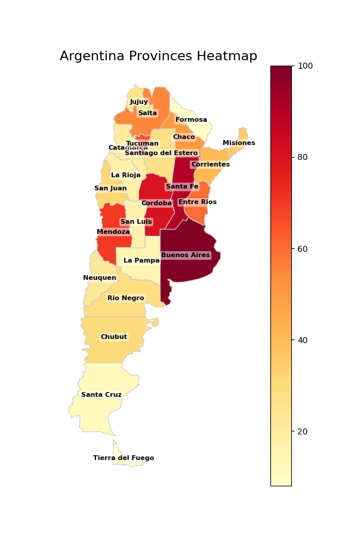

# Mapa GeoJSON de Argentina

Este repositorio ofrece un mapa GeoJSON de Argentina y un script en Python para visualizar y analizar datos por provincia. Permite crear mapas de calor y realizar análisis geográfico de manera sencilla para fines educativos, científicos o presentaciones.

- Incluye el archivo `argentina.geojson` con los límites provinciales.
- Script de ejemplo para generar mapas de calor con datos personalizados.
- Ideal para análisis de datos, visualización y proyectos de mapeo.

¡Siéntete libre de usar y adaptar los recursos para tus propios análisis de datos!
